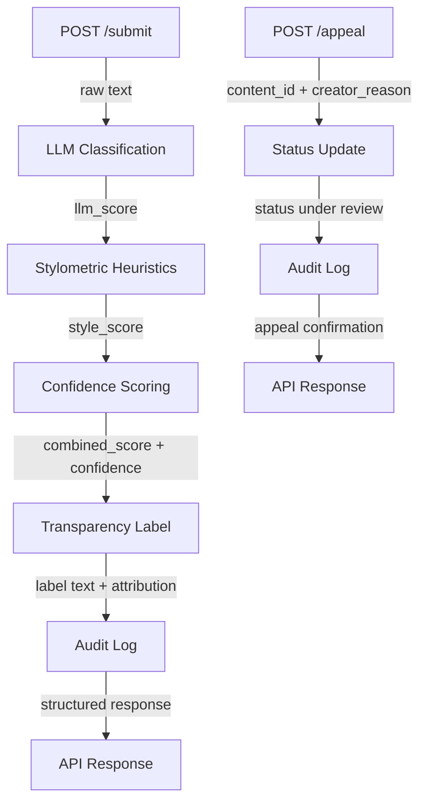

## Architecture
**Explanation** When a user submits text to the POST /submit endpoint, the raw text is passed into the LLM semantic analysis and then into the stylometric analysis. The signal scores from each are combined to get a weighted confidence level. Then we use the result to create a transparency label for the user, which is logged in audit log, and then returned as a structured API response. If there is an appeal, then we get their submitted reasnoning and content status is updated to under review, the appeal is added to audit log and we send a confirmation response. 

## Detection signals
1. **LLM-based classification:** semantic assessment by LLM. It will catch if the meaning or style together read like AI or human. Output is a score 0-1
2. **Stylometric heuristics:** Structural checks in Python. Checks statistical properties of the text to see if consistent with human or AI, such as, punctuation, sentence length, etc. Output is a score 0-1

**Confidence Scoring:** weighted_score = (llm_score*0.6 + style_score*0.4)
- will combine llm score and style scoring with LLM weight a little higher because meaning is a slightly better metric than structure. 

## Rate Limiting

## AI Tool Plan