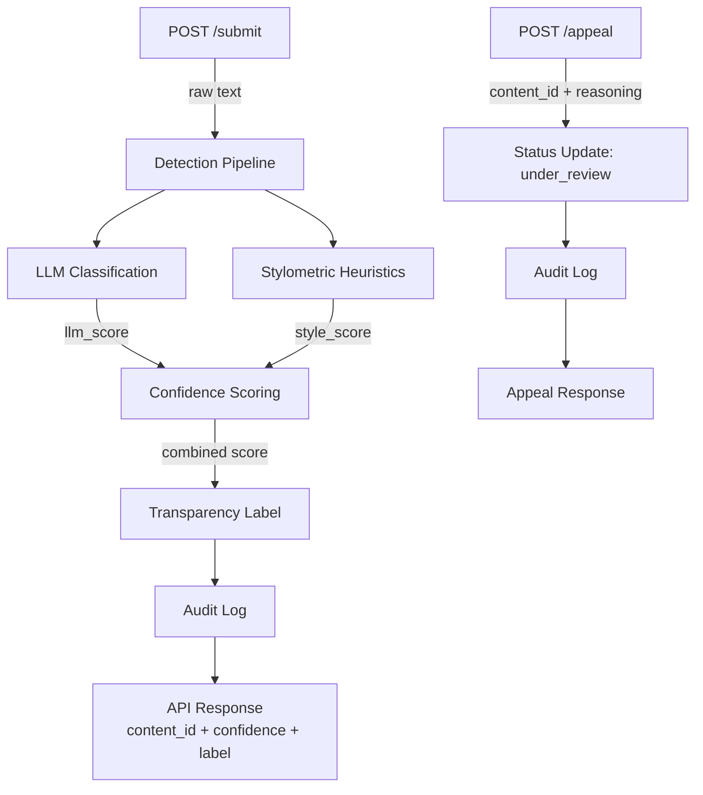

# Planning.md

## Architecture
**Explanation** When a user submits text to the POST /submit endpoint, the raw text is passed into two independent detection signals: LLM semantic analysis and the stylometric analysis. The signal scores from each are combined to get a weighted confidence level. Then we use the result to create a transparency label for the user, which is logged in audit log, and then returned as a structured API response. If there is an appeal, then we get their submitted reasnoning and content status is updated to under review, the appeal is added to audit log and we send a confirmation response. 

## Detection signals
1. **LLM-based classification:** semantic assessment by LLM. It will catch if the meaning or style together read like AI or human. Output is a score 0-1
2. **Stylometric heuristics:** Structural checks in Python. Checks statistical properties of the text to see if consistent with human or AI, such as, punctuation, sentence length, etc. Output is a score 0-1

**Confidence Scoring:** weighted_score = (llm_score x 0.6) + (style_score x 0.4)
- will combine llm score and style scoring with LLM weight a little higher because meaning is a slightly better metric than structure. 

### Uncertainty Representation** 
- Confidence scores go from 0.0 to 1.0
- 0.50 confidence score means no strong signal agreement
- Scores closer to 0.0 are more human-reading
- Scores closer to 1.0 are more AI-leaning
- A confidence score of 0.60 should be weakly leaning towards AI-generated

### Thresholds for combined confidence score
- >= 0.80 = High-confidence AI
- 0.40 - 0.79 = Unceratin
- < 0.40 = High-confidence Human

## Transparency label design 
- High confidence AI result: High-confidence AI 
- High confidece human Result: high-confidence Human
- Uncertain: Uncertain / Mixed signals

## Appeals
Only the creator of the text can submit an appeal; they should be associated with the content_id.
- **What information do they submit?** content_id (int) and creator_reasoning (str)
- Status is updated to "under_review"
- log appeal event in the audit log
- no re-scoring
- A human reviewer opening the queue will see creator_id, user_id and creator reasoning for each request

## Edge Cases
- Formal academic writing: similar to AI because of style and details. Might get flagged as AI by LLM
- Short texts: cannot get enough stylometry info so may get flagged. 

## Rate Limiting
- /submit is rate limited to 10 requests per minute and 100 requests per day per IP address to prevent spam and abuse.

## AI Tool Plan
### M3 submission endpoint + first signal
- I will give the AI tool the description of the first signal (LLM classification) from planning.md and the disgram. I will ask it to generate a Flask app skeleton and the first signal function. I will verify by testing with a few inputs to the function before wiring to endpoint. 
### M4 second signal + confidence scoring
- I will give the AI tool the description of the second signal (stylometry) and the combined confidence score formula. I will ask for a second signal function and the scoring function. Then I will check against human written text and AI-written text to see if scores make sense.
### M5 production layer 
- I will give the AI tool my label descriptions + threshold mappings along with the appeal flow/diagram. I will ask for the label-generation logic and the /appeal endpoint. I will verify by testing that all three label variants are being produced and that appeal updates status correctly. 
